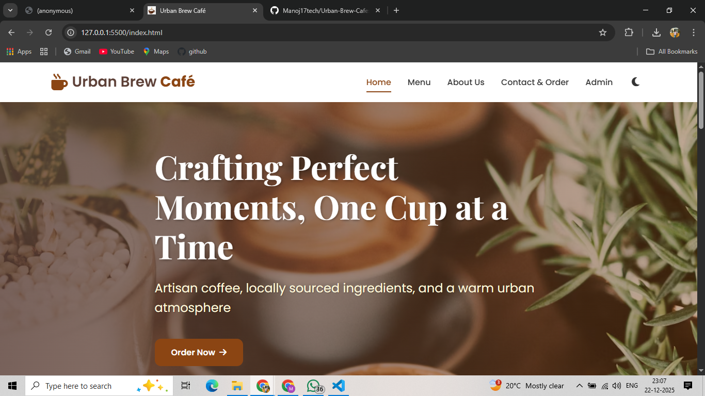
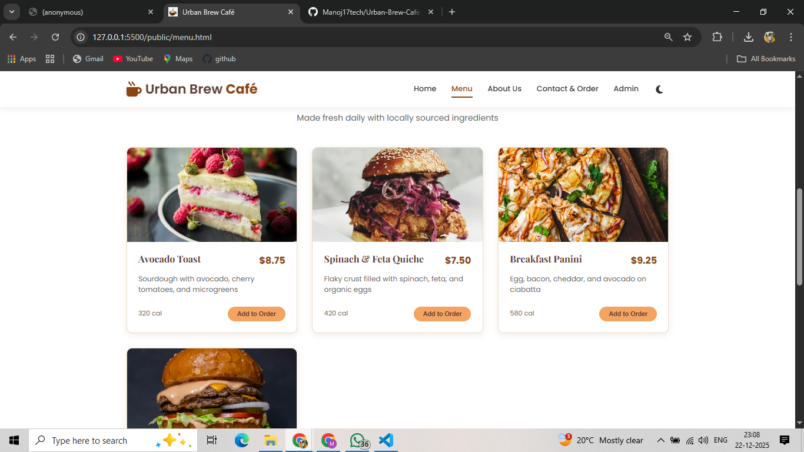
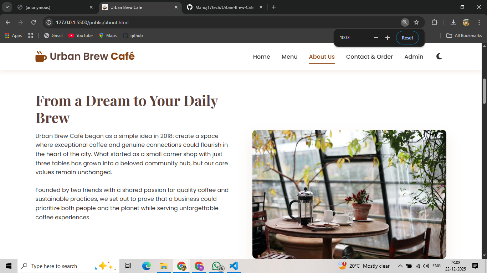
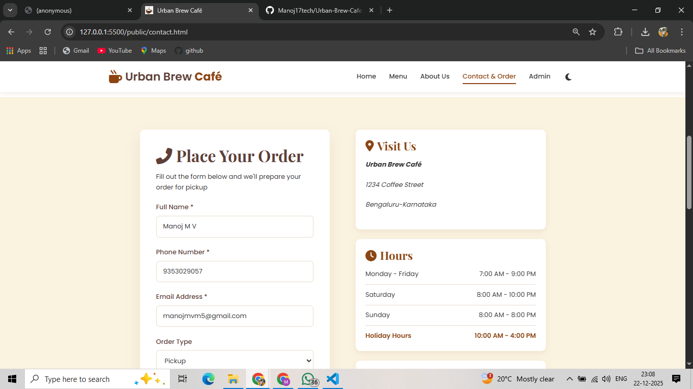
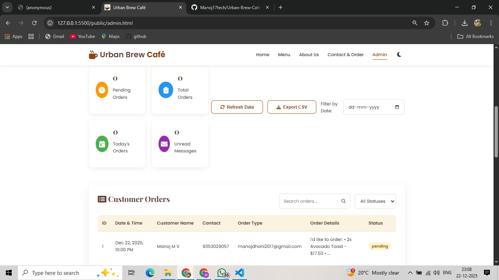
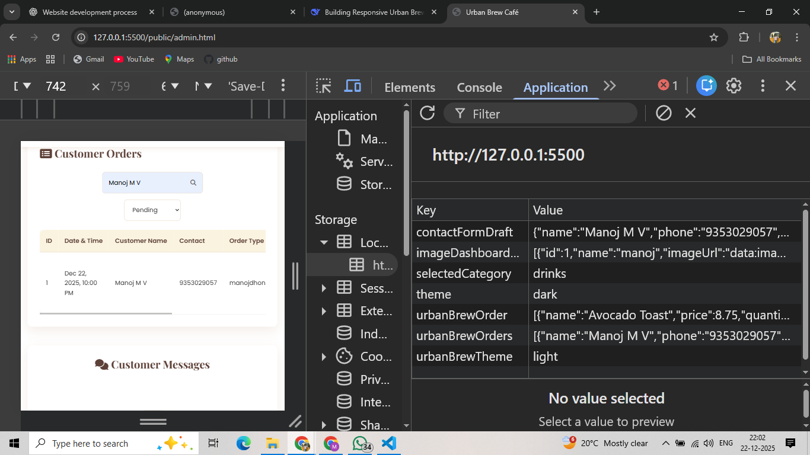

# ☕ Urban Brew Café – Website

A modern, fully responsive café website built to demonstrate professional frontend development skills, clean UI/UX design, and real-world functionality using **HTML, CSS, and Vanilla JavaScript**.

---

## 📌 Project Overview

**Urban Brew Café** is a multi-page café website designed with a warm, inviting café aesthetic.  
The project focuses on usability, responsiveness, form handling, and client-side data persistence while maintaining clean and maintainable code.

This website is suitable for live deployment and client delivery.

---

## 🌐 Pages Included

- **Home** – Hero section, café introduction, featured menu items, and call-to-action
- **Menu** – Categorized menu (Coffee, Snacks, Desserts) with images and prices
- **About Us** – Café story, mission, values, and “Why Choose Us”
- **Contact / Order** – Validated form for orders and messages
- **Admin (Read-Only)** – View submitted orders/messages

---

## 🛠️ Tech Stack

- **HTML5** – Semantic and accessible markup
- **CSS3** – Flexbox, Grid, responsive design, animations
- **JavaScript (ES6+)** – Form validation, LocalStorage handling, UI interactions
- **LocalStorage** – Client-side data persistence

> No frameworks or UI libraries are used.

---

## ✨ Key Features

- Fully responsive design (mobile, tablet, desktop)
- Warm café-style UI/UX
- Light / Dark mode toggle with proper font and color adjustments
- Form validation with inline error messages
- Data storage using LocalStorage
- Read-only admin dashboard to view submissions
- Clean navigation and smooth hover effects
- SEO-friendly HTML structure

---

## 🖼️ Screenshots

> Screenshots are added inside the `screenshots/` folder.

### 🏠 Home Page



### 📋 Menu Page



### ℹ️ About Us Page



### 📞 Contact / Order Page



### 🔐 Admin Dashboard



### Local Storage (DB)



---

## 📁 Project Structure
```
urban-brew-cafe/
│
├── index.html # Home page
├── menu.html # Menu page
├── about.html # About Us page
├── contact.html # Contact / Order page
├── admin.html # Admin (read-only) page
│
├── css/
│ └── style.css # Global styles (layout, colors, responsiveness)
│
├── js/
│ ├── main.js # Navigation, theme toggle, UI interactions
│ ├── form.js # Form validation & LocalStorage handling
│ └── admin.js # Fetch and display stored form data
│
├── screenshots/ # Website screenshots
│
└── README.md # Project documentation
```
---

## 🧾 Form & Admin Logic

- All form fields are mandatory
- Email and phone number validation is enforced
- On successful submission:
  - Data is saved in LocalStorage as JSON
  - A success message is displayed
  - Form fields are reset
- Admin page fetches and displays stored data in read-only mode

---

## 📱 Responsiveness

- Mobile-first design approach
- Tested across:
  - Mobile devices
  - Tablets
  - Desktop screens
- Navigation and forms adapt smoothly on smaller screens

---

## 🌙 Light / Dark Mode

- Toggle switch to change theme
- Theme preference persists using LocalStorage
- Fonts, text colors, and backgrounds adjust automatically for readability

---

## 🚀 How to Run Locally

1. Clone the repository

   ```bash
   git clone https://github.com/Manoj17tech/Urban-Brew-Cafe.git

   ```

2. Navigate to the project folder

   ```bash
      cd Urban-Brew-Cafe

   ```

3. Open index.html in any modern browser
   (or use Live Server in VS Code)


### 🌍 Live Demo

🔗 Live Website: (Add Netlify / Vercel deployment link here)


### 📈 Future Enhancements

Backend integration

Online payment support

Admin authentication

Order management system

CMS-based menu updates

👨‍💻 Author

Developed by Manoj M V
Full-Stack Web Developer

📞 Phone: +91 93530 29057
💌 Email: manojmvm5@gmail.com

📄 License

This project is created for educational and client-demonstration purposes.